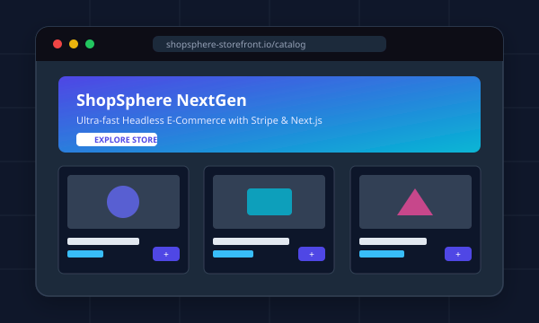

# Modern Personal Portfolio Web Application

A clean, modern, fully responsive, and ready-to-deploy personal portfolio website application built with semantic HTML5, modern CSS3 (Custom Properties, Flexbox, Grid), and vanilla ES6+ JavaScript.



---

## 🌟 Key Features

- **"Ask Sonali" AI Portfolio Chatbot**: Intelligent interactive conversational chatbot providing answers about Sonali's education, skills, projects, contact details, and resume, featuring quick prompt chips and action links.
- **Prominently Displayed Identity**: Eye-catching Hero section with large typography, vibrant gradient branding, and dynamic typewriter animation cycling through professional roles.
- **Full Navigation System**: Smooth scrolling navigation linking to **Home**, **About**, **Education**, **Skills**, **Projects**, and **Contact** sections with active section highlighting on scroll.
- **Dark & Light Mode Switcher**: Seamless theme switcher with persistence in `localStorage` and automatic system preference detection (`prefers-color-scheme`).
- **Interactive Mobile Drawer**: Slide-out responsive mobile navigation menu with backdrop blur and outside-click auto-dismissal.
- **Detailed About Me Section**: Narrative biography, personal stats counters (Years Experience, Projects Completed, Uptime), and quick facts panel.
- **Academic Education Timeline**: Elegant vertical timeline detailing university degrees, graduation honors, dates, and core relevant coursework.
- **Categorized Skills Matrix**: Modern cards for Frontend, Backend & APIs, Cloud/DevOps & Databases, and Professional/Soft Skills with visual badges.
- **Filterable Projects Showcase**: Featured cards with mockups, descriptions, tech stack pills, and direct buttons for **Live Demo** and **GitHub Repository**, plus interactive category tabs (*All*, *Full Stack*, *Frontend*, *Backend*).
- **Downloadable & Embeddable Resume (PDF)**: Includes an actual formatted PDF resume (`assets/docs/resume.pdf`) with one-click download buttons in the navigation bar, hero, and dedicated resume callout section.
- **Validated Contact Form & Information**: Contact cards for direct Phone (`tel:`), Email (`mailto:`), and physical location, clickable LinkedIn and GitHub badges, and an interactive contact form with real-time validation and toast feedback.
- **Accessible & SEO Ready**: Semantic HTML5 elements, ARIA labels, meta tags for search engines, and OpenGraph preview cards for social media sharing.

---

## 📁 Application Folder Structure

```
PersonalPortfolio/
│
├── index.html                  # Main application entry file (fully commented)
│
├── css/
│   ├── style.css               # Design system, CSS variables, dark/light themes, responsive layout
│   └── chatbot.css             # Dedicated styling for Ask Sonali chatbot widget
│
├── js/
│   ├── main.js                 # Theme toggle, typewriter, project filter, form validation, toast
│   └── chatbot.js              # Knowledge base, NLP intent matcher, and chatbot controller
│
├── assets/
│   ├── images/
│   │   ├── favicon.svg         # Modern vector monogram favicon
│   │   ├── profile-avatar.svg  # Professional developer avatar illustration
│   │   ├── project-1.svg       # ShopSphere E-Commerce mockup
│   │   ├── project-2.svg       # TaskFlow AI Board mockup
│   │   ├── project-3.svg       # NovaPay FinTech Dashboard mockup
│   │   └── project-4.svg       # DevPulse Cloud Infrastructure mockup
│   │
│   └── docs/
│       └── resume.pdf          # Formatted PDF resume ready for download and preview
│
├── generate_resume.py          # Python utility to regenerate or modify resume.pdf
├── package.json                # Optional scripts for local dev server
├── netlify.toml                # Netlify deployment configuration
├── vercel.json                 # Vercel deployment configuration
└── README.md                   # Setup guide, customization instructions, and deployment steps
```

---

## 🚀 Quick Start (Local Preview)

### Option 1: Double Click (Zero Config)
Simply double-click `index.html` in your file explorer to open it in any web browser (Chrome, Edge, Firefox, Safari).

### Option 2: Python Built-in Server
Run the following command from the root directory:
```bash
python -m http.server 3000
```
Then open `http://localhost:3000` in your browser.

### Option 3: Node.js (npx serve)
```bash
npx serve . -l 3000
```
Then open `http://localhost:3000` in your browser.

---

## 🎨 Customization Guide

All sections in [`index.html`](index.html), [`css/style.css`](css/style.css), and [`js/main.js`](js/main.js) are clearly labeled with structural comments.

### 1. Change Name & Personal Branding
- Open [`index.html`](index.html) and search for `Alex Morgan`.
- Replace instances with your own name.
- Update the `<title>` tag and OpenGraph `<meta>` tags.

### 2. Update Hero Typewriter Titles
- Open [`js/main.js`](js/main.js) and locate the `phrases` array around line 84:
  ```javascript
  const phrases = [
    'Full Stack Software Engineer',
    'UI/UX & Frontend Architect',
    'Cloud & Distributed Systems Specialist',
    'Open Source & Clean Code Enthusiast'
  ];
  ```
- Replace these with your target roles or specialties.

### 3. Replace Profile Picture / Avatar
- Place your personal photo in `assets/images/` (e.g. `profile.jpg` or `profile.png`).
- In [`index.html`](index.html), find the `` tags pointing to `assets/images/profile-avatar.svg` and update the `src` attribute.

### 4. Update Resume (PDF)
- Replace `assets/docs/resume.pdf` with your actual PDF resume.
- Alternatively, modify [`generate_resume.py`](generate_resume.py) with your credentials and run `python generate_resume.py` to auto-generate a fresh PDF.

### 5. Add or Edit Projects
- In [`index.html`](index.html), navigate to `<section id="projects">`.
- Duplicate or modify the `<article class="project-card">` elements.
- Ensure the `data-category` attribute matches one of your filter categories (`fullstack`, `frontend`, `backend`).

### 6. Connect Contact Form to Backend (Optional)
The current contact form handles validation and simulates submission with an instant toast notification. To send actual emails directly without writing server code, you can connect it to free services like:
- **Formspree**: Change `<form id="contact-form">` to `<form action="https://formspree.io/f/YOUR_FORM_ID" method="POST">`.
- **EmailJS**: Add the EmailJS script tag and trigger `emailjs.sendForm(...)` inside [`js/main.js`](js/main.js).

---

## 🌐 Deployment Instructions

This application is 100% static and ready to deploy with zero build steps:

### 1. Deploying to GitHub Pages
1. Push this repository to GitHub:
   ```bash
   git init
   git add .
   git commit -m "Initial portfolio commit"
   git branch -M main
   git remote add origin https://github.com/<your-username>/<your-repo-name>.git
   git push -u origin main
   ```
2. Go to your repository on GitHub -> **Settings** -> **Pages**.
3. Under **Build and deployment**, select **Deploy from a branch**.
4. Choose **main** branch and `/ (root)` folder, then click **Save**.
5. Your portfolio will be live at `https://<your-username>.github.io/<your-repo-name>/`.

### 2. Deploying to Netlify
1. Log in to [Netlify](https://www.netlify.com/).
2. Drag and drop the `PersonalPortfolio` folder directly onto the Netlify dashboard.
3. Your site is live immediately! (`netlify.toml` is already configured).

### 3. Deploying to Vercel
1. Install Vercel CLI: `npm i -g vercel` (or link via [vercel.com](https://vercel.com/)).
2. Run:
   ```bash
   vercel
   ```
3. Follow the prompts (use default settings). Your site is deployed in seconds! (`vercel.json` is already configured).

---

## 📄 License
MIT License. Free to use and customize for personal and commercial portfolios.
